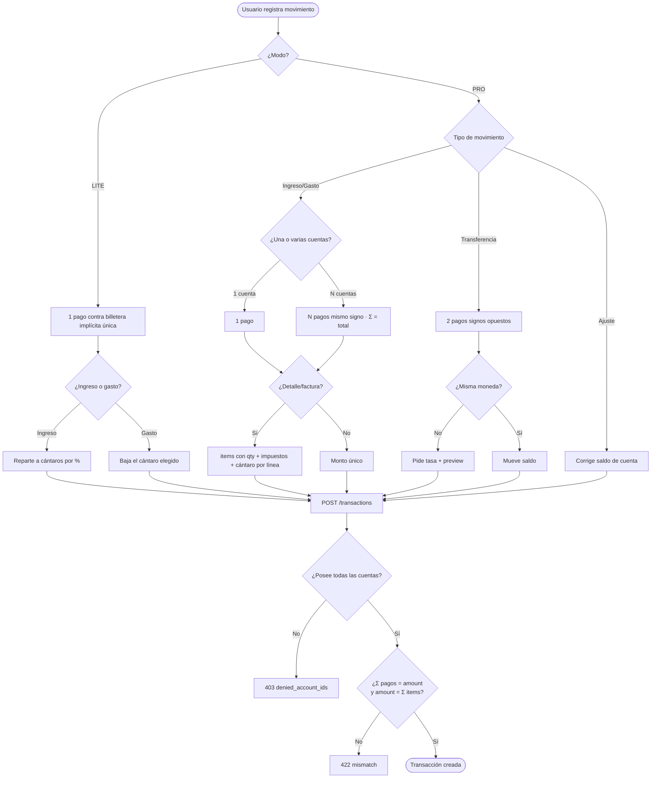
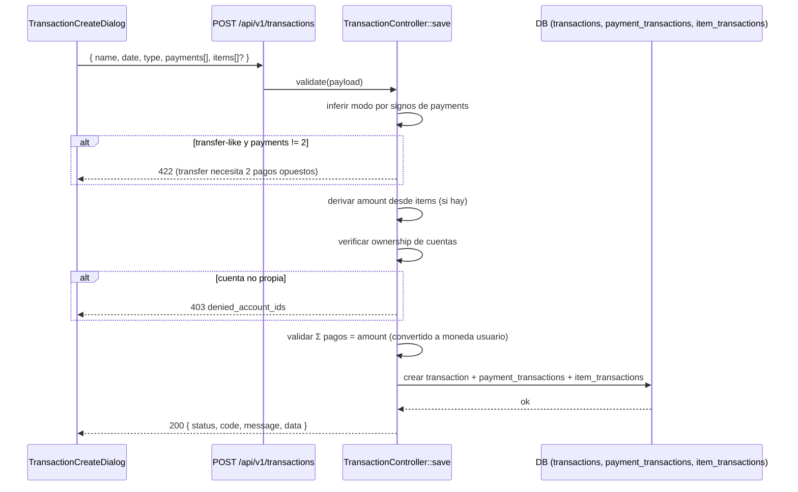

# Flujos de Registro de Transacciones — OWFINANCE 2026

> Caminos posibles para registrar una transacción (modelo real del código), diagramas Mermaid
> y propuestas de optimización del sistema de finanzas personales.
> Backend: `TransactionController::save()` · Frontend: `TransactionCreateDialog.vue`.
> Última actualización: 2026-06-02.

---

## 1. Modelo unificado

Todo movimiento se crea con **`POST /api/v1/transactions`**. No hay un endpoint por tipo:

```
Transacción = cabecera + payments[] (1..N) + items[] (0..N)
```

- **`payments[]`** (requerido, min 1): de qué cuenta(s) sale/entra el dinero.
  `{ account_id, amount, rate?, is_current?, is_official? }`
- **`items[]`** (opcional): desglose tipo factura.
  `{ name, quantity, amount, tax_id?, jar_id?, category_id?, ... }`
- El **tipo de movimiento se infiere del signo y cantidad de pagos**, además del
  `transaction_type_id` (income / expense / transfer / payment / ajuste).

---

## 2. Caminos posibles (descripción)

### A) Ingreso / Gasto simple
**1 pago.** El caso más común. Monto, concepto, cuenta, categoría y cántaro.
- Ingreso → reparte a cántaros por %. Gasto → baja el cántaro imputado.
- En el dialog: `isAdvancedPayment = false`, `isAdvancedAmount = false`.

### B) Transferencia entre cuentas
**Exactamente 2 pagos con signos opuestos**: uno negativo (origen) y uno positivo (destino).
- Regla dura del backend: si es "transfer-like" y no hay exactamente 2 pagos → **422**.
- Si las cuentas son de distinta moneda → pide **tasa** y muestra preview (multiplicar/dividir).
- No es ingreso ni gasto: no toca cántaros, solo mueve saldo entre cuentas.

### C) Pago múltiple (split en varias cuentas)
**N pagos del mismo signo.** Un mismo gasto pagado con varias cuentas (ej. mitad efectivo,
mitad tarjeta).
- En el dialog: `isAdvancedPayment = true`. Valida que **Σ pagos = total** (`paymentsMismatch`).

### D) Con detalle / factura (items)
Se añaden `items[]` con cantidad e impuestos por línea.
- El `amount` de la transacción se **deriva** de `Σ(amount × quantity)` y debe cuadrar con el
  monto declarado (tolerancia 0.01). Soporta ítems negativos (gastos).
- Cada ítem puede imputarse a su propio **cántaro** y **categoría**.

### E) Cross-currency (multimoneda)
Cualquier camino anterior con cuentas en otra moneda. Cada pago lleva `rate` + banderas
`is_current`/`is_official`; el backend valida la suma **convertida a la moneda del usuario**
(`resolveUserCurrencyRate`).

### F) Ajuste
`transaction_type_id = ajuste`. Corrige el saldo de una cuenta sin un movimiento "real".

### G) Carga masiva (bulk)
**`POST /api/v1/transactions/bulk`** → `bulkSave()`, con **dry-run** (vista previa).
⚠️ Bugs abiertos BUG-001..005 (preview, transfer en dry-run, saldo post-import).

### Validaciones transversales
- **Ownership**: el usuario debe poseer **todas** las cuentas de los pagos, o **403** con
  `denied_account_ids`.
- **Amount vs items**: si hay items y amount, deben coincidir.
- `include_in_balance` permite movimientos informativos que no afectan saldo.

---

## 3. Diagrama — árbol de decisión del registro



## 4. Diagrama — secuencia del backend `save()`



---

## 5. Propuestas de optimización 🚀

> Objetivo: simplificar el registro (sobre todo LITE), reducir errores y mantenibilidad.

### P1 — Capa de servicio única `TransactionService` (backend) 🔴 alta
`save()` tiene ~370 líneas con validación, inferencia de modo, derivación de monto, ownership y
conversión mezcladas. Extraer a un `TransactionService` con métodos claros
(`registerSimple`, `registerTransfer`, `registerSplit`, `registerWithItems`). Reduce el riesgo
de los BUG-001..005 y hace testeable cada camino.

### P2 — Endpoints semánticos opcionales (DX) 🟡 media
Mantener `POST /transactions` unificado, pero exponer atajos:
`POST /transactions/transfer`, `/transactions/expense`, `/transactions/income`. El front (y la
IA de voz/OCR) arma payloads más simples; el backend traduce al modelo unificado.

### P3 — Quick-add en LITE de 1 toque 🔴 alta
En LITE, registrar gasto debería ser: **monto → cántaro → listo** (cuenta = billetera
implícita, fecha = hoy, sin items). Meta: < 3 segundos. Es el corazón de "priorizar facilidad".

### P4 — Romper `TransactionCreateDialog.vue` (3.614 líneas) 🔴 alta
Dividir en subcomponentes: `SimpleForm`, `TransferForm`, `SplitPayments`, `ItemsEditor`,
`RatePreview`. Hoy es el archivo más grande del front y mezcla 5 modos en un solo SFC.

### P5 — Motor de reglas / auto-categorización 🟡 media
Aprender de transacciones pasadas (provider/concepto → categoría/cántaro sugeridos). Acelera el
registro y prepara terreno para la IA. Reutiliza el `category_id`/`jar_id` por ítem ya existente.

### P6 — Idempotencia y borradores 🟡 media
`Idempotency-Key` en `POST /transactions` (evita duplicados por doble toque / reintento móvil) y
guardado de borrador local (offline-first con Capacitor).

### P7 — Plantillas de transacción recurrente 🟢 baja
Movimientos frecuentes (renta, sueldo) como plantillas de 1 toque; base para programadas.

### P8 — Validación de saldo en tiempo real 🟡 media
Mostrar impacto en cántaro/cuenta **antes** de guardar (preview de saldo resultante). Cierra la
familia de BUG-003 (saldo post-import) llevando la verdad del saldo al front.

### P9 — Telemetría de fricción 🟢 baja
Medir tiempo y abandonos por modo para saber qué camino optimizar (alimenta P3/P5).

---

## 6. Relación con el modo dual
- LITE ejerce **solo el camino A** (1 pago, billetera implícita) + ingreso que reparte.
- PRO ejerce **todos** los caminos (A–G).
- El gating (TECH-LP-01) decide qué caminos se exponen según `layout_mode`.

Ver `MODOS_LITE_VS_PRO.md`, `CUENTAS_Y_TRANSACCIONES.md`, `MODELO_CANTAROS.md`.
